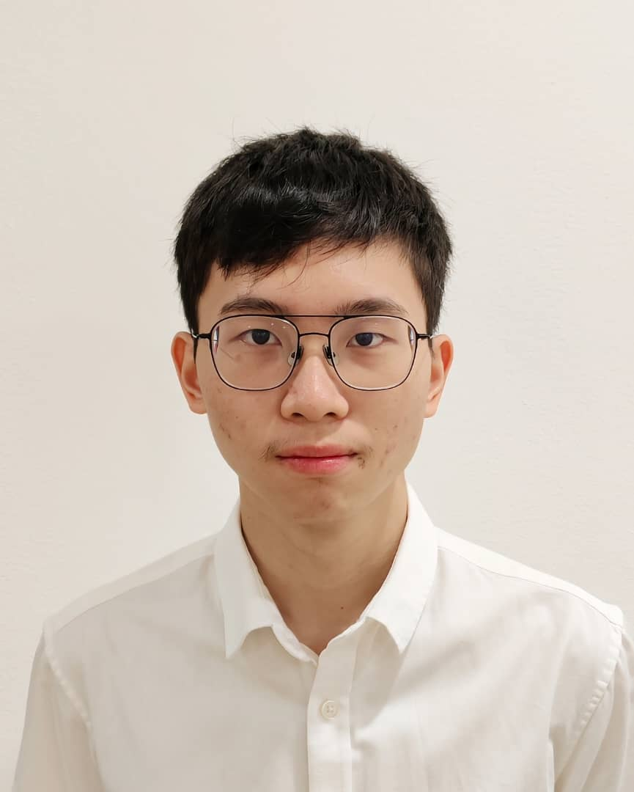

# About

{ .jo-portrait }

I'm **Joshua Oh Yu Qiao**, a third-year Electronic and Electrical Engineering
undergraduate at Sunway University, Malaysia, currently on a CGPA of **3.89 / 4.00**.
My work sits where software meets hardware: the projects on this site all involve a
model or a piece of logic that has to produce a physical result — a servo that moves,
a valve that closes, an alert that reaches someone in time.

What I keep coming back to is the part of a project where the clean idea meets
reality. A YOLO model with a 0.984 mAP is an interesting artefact; making it drive
diverter arms without firing on a single noisy frame, and confirming the item
actually landed by weight rather than by a hopeful `delay()`, is the part I find
genuinely interesting. So is discovering that a solar panel produces 4.68 mW against a
12.8 W requirement, and having to redesign around that honestly instead of quietly
dropping "solar" from the title.

I work in a structured way because I've seen it pay off — weighted decision matrices
for component selection, critical-path analysis for scheduling, and stakeholder input
gathered before the design is locked rather than after. On the irrigation project I
was project manager as well as the software engineer, coordinating a five-person team
across mechanical design, circuitry and firmware.

## What I'm looking for

!!! tip "Available for a 12-week placement: 25 January – 23 April 2027"

    I'm actively looking for an internship in that window. The fastest way to reach
    me is [email](contact.md).

I'm interested in **internship and graduate roles** in embedded systems, IoT, or
applied computer vision — teams building products where firmware, sensing and a bit
of machine learning have to work together on real hardware. I'm equally happy writing
the Python backend or the C++ that runs on the microcontroller, and I like projects
where I get to see the whole path from sensor to outcome.

## Skills

<section markdown="1">
### Programming
C / C++ · Python (NumPy, Pandas, OpenCV, PyTorch / Ultralytics) · MATLAB &amp; Simulink ·
Git &amp; GitHub · VS Code · PlatformIO · Arduino IDE
</section>

<section markdown="1">
### Machine learning &amp; vision
Ultralytics YOLO (custom dataset collection, training, validation, tuning) · OpenCV ·
Whisper (speech-to-text) · Google Gemini API · Piper TTS
</section>

<section markdown="1">
### Embedded &amp; hardware
ESP32 · ESP8266 / NodeMCU · sensor interfacing over I²C / I²S / UART / OneWire ·
24 GHz mmWave radar (LD2450) · DS18B20 · HX711 load cells · I²S MEMS microphones ·
servo &amp; relay actuation · voltage regulation and power budgeting ·
soldering and perfboard prototyping · oscilloscopes and multimeters
</section>

<section markdown="1">
### IoT, cloud &amp; AI
MQTT · Flask REST APIs · SQLite · HTTP/REST device communication ·
LLM and speech-pipeline integration · Blynk · ThingSpeak ·
SMTP &amp; Telegram alerting · real-time dashboards and data logging
</section>

<section markdown="1">
### Design &amp; simulation
SOLIDWORKS · Onshape · Autodesk Fusion 360 · EasyEDA · NI Multisim ·
FDM 3D printing in PLA and ABS · enclosure and weatherproofing design
</section>

<section markdown="1">
### Engineering practice
CDIO framework · weighted decision-matrix trade studies · work breakdown structures ·
Gantt charts, critical path method &amp; budget variance analysis ·
bill-of-materials and whole-life cost analysis · laboratory instrumentation ·
stakeholder engagement · technical report writing
</section>

<section markdown="1">
### Spoken languages
Bahasa Malaysia · English · Mandarin · Cantonese *(fluent)* · German *(basic)*
</section>

## Education

**Bachelor of Electronic and Electrical Engineering with Honours** — Apr 2024 – Apr 2028
School of Engineering, Faculty of Engineering and Technology, Sunway University, Subang Jaya

- Current CGPA **3.89 / 4.00**
- **Dean's List** — Sep 2024, Apr 2025 and Sep 2025 semesters
- **Jeffrey Cheah Entrance Scholarship** recipient

**Cambridge A-Levels — 3A** (Mathematics, Physics, Chemistry) — Jul 2022 – Nov 2023
INTI International College Subang — *Top Student, A-Level (2023) and AS-Level (2023)*

**Sijil Pelajaran Malaysia (SPM)**, Science Stream — 8A, 1B — Jan 2017 – Mar 2022
SMK Bandar Sri Damansara 1, Kuala Lumpur

Coursework represented on this site includes Sustainable Engineering Design,
Integrated Design Project, and Project Management & Engineering Design.

## Experience

**Assistant Head, Events &amp; Social Media** — Sales Support Team (part-time)
INTI International College Subang · Feb 2023 – Apr 2024

Led a team of 8–12 student helpers across the Mid Valley Higher Education Fair, INTI
Open Day and the WOW Event — running recruitment alongside the HR team, chairing
pre-event meetings and training sessions, and handling data entry and lead-collection
calls.

It isn't engineering work, but it is where I learned to run a team to a deadline,
which is what I was doing again as project manager on the irrigation controller.

## Beyond the technical

Two things show up across all three projects that I'd point an employer to. The first
is **sustainability as a design input rather than a section at the end** — material
selection scored on carbon footprint, designs built for disassembly and e-waste
recovery, and whole-life cost analysis rather than just a BOM total. The second is
**reporting results honestly**. The write-ups here include the class imbalance behind
a strong mAP figure, the solar panel that could not do the job it was specified for,
and the components that were destroyed learning something. That is deliberate.

---

Want the detail in one page? [Download my resume](assets/resume-joshua-oh.pdf) or
[get in touch](contact.md).
