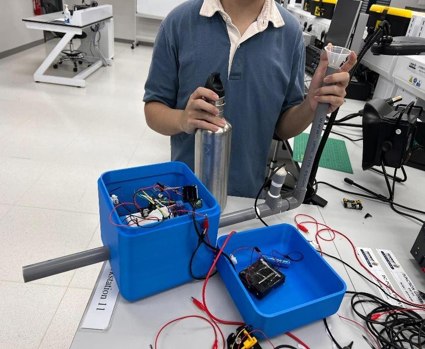

Electronic &amp; Electrical Engineering — Sunway University

# Joshua Oh

I build embedded systems that have to work in the physical world — a conveyor that
sorts waste by what a camera sees, a radar-based fall detector for someone living
with dementia, a solar-charged valve that keeps scalding water off a farmer's crops.

**I take projects the whole way down the stack:** trained models, C++ firmware,
Python backends, circuit design, CAD and 3D printing, and the IoT dashboards that
make the thing observable once it's running.

[View projects](projects/index.md){ .jo-primary }
[About me](about.md)
[Get in touch](contact.md)

## Featured projects

-   

    **[Computer Vision Smart Waste Segregation](projects/smart-waste-segregation.md)**

    Team of 6 · Built &amp; demonstrated · Jul 2025

    A conveyor rig that identifies metal, paper and plastic with a custom-trained
    YOLO model and diverts each into its own weighed bin. Reached **0.984 mAP@0.5**
    on the validation set.

    <ul class="jo-tags"><li>YOLOv11</li><li>Python</li><li>ESP32</li><li>OpenCV</li><li>Blynk IoT</li></ul>

-   

    **[PIPER — Dementia Assistive Robot](projects/piper.md)**

    Team of 4 · Design stage · Apr 2026 —

    A privacy-preserving companion robot: mmWave radar for fall detection instead of
    a camera, and a local Whisper → Gemini → Piper TTS voice pipeline with a memory
    of the user's day.

    <ul class="jo-tags"><li>ESP32</li><li>Whisper</li><li>Gemini</li><li>MQTT</li><li>mmWave radar</li></ul>

-   

    **[Solar Irrigation Control](projects/solar-irrigation.md)**

    Project manager · Built &amp; tested · Aug 2025

    Pipeline water in Malaysia can exceed 50 °C under the sun. This solar-charged
    controller measures it and holds the valve shut until it is safe to irrigate.
    Built for **RM 135.91**.

    <ul class="jo-tags"><li>ESP8266</li><li>C++</li><li>Blynk</li><li>ThingSpeak</li><li>Solar / Li-ion</li></ul>

## What I work with

<section markdown="1">
### Languages
Python · C++ (Arduino) · MATLAB
</section>

<section markdown="1">
### ML &amp; vision
Ultralytics YOLO · OpenCV · Whisper (STT) · Gemini API · Piper TTS
</section>

<section markdown="1">
### Embedded &amp; IoT
ESP32 · ESP8266 · I²S audio · HX711 load cells · mmWave radar · servos &amp; relays
</section>

<section markdown="1">
### Protocols &amp; services
HTTP · MQTT · SMTP · SQLite · Blynk · ThingSpeak · Telegram Bot API
</section>

<section markdown="1">
### Mechanical
SOLIDWORKS · Fusion 360 · FDM 3D printing (PLA / ABS) · EasyEDA
</section>

<section markdown="1">
### Practice
Decision-matrix trade studies · CDIO · Gantt / critical path · stakeholder engagement
</section>

!!! info "About these write-ups"

    Every figure, metric and cost on this site is taken from the project reports
    themselves — the YOLO curves, schematics, CAD renders and bench measurements are
    the original artefacts, not recreations. Where a project is still in progress,
    the page says so rather than implying a finished result.
