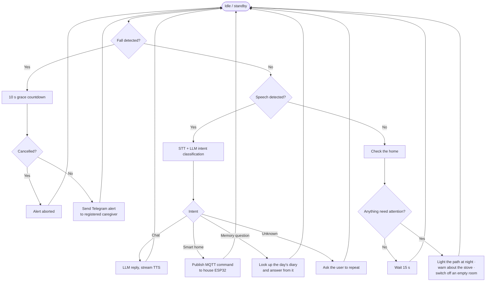
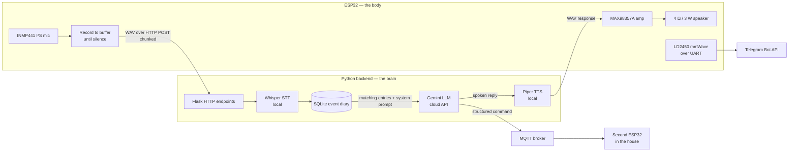
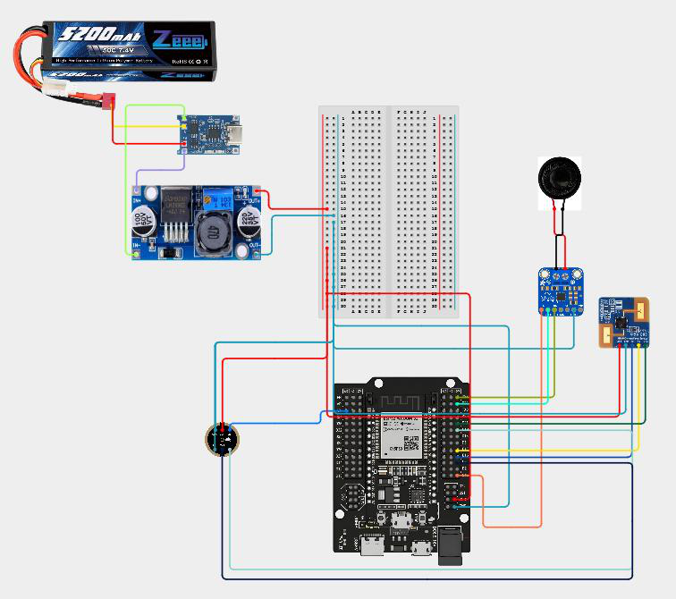
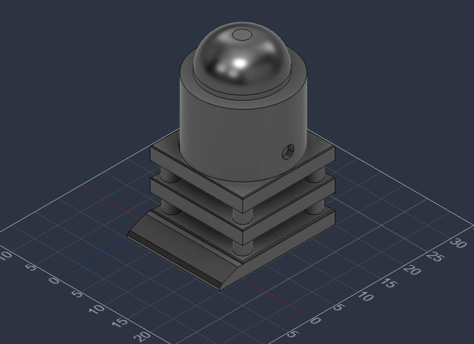

# PIPER — Dementia Assistive Robot

A stationary in-home companion for people living with early-to-moderate dementia.
PIPER detects falls with **mmWave radar rather than a camera**, holds a natural
conversation through a Whisper → Gemini → Piper TTS pipeline, remembers what the user
did today so it can answer *"have I taken my pills?"*, and controls household
appliances by voice over MQTT.

<ul class="jo-tags">
<li>ESP32-WROOM-32</li><li>C++ / Arduino IDE</li><li>Python</li><li>Flask</li>
<li>Whisper</li><li>Google Gemini</li><li>Piper TTS</li><li>SQLite</li><li>MQTT</li>
<li>Telegram Bot API</li><li>LD2450 mmWave radar</li><li>I²S audio</li><li>Fusion 360</li>
</ul>

<dl>
  <dt>Context</dt><dd>Integrated Design Project 1, Sunway University — supervised by Dr Chia Wai Chong</dd>
  <dt>Timeline</dt><dd>April 2026 semester; report submitted 26 August 2026; build running to 31 December 2026</dd>
  <dt>My role</dt><dd><strong>System Architect &amp; Firmware Lead</strong> — in a four-person team (Tay Shuen Min, Jordan Douglas Su E-Wern, Oh Yu Qiao, Puteri Amelya Dania)</dd>
  <dt>Status</dt><dd><strong>Design stage.</strong> Architecture, circuit, power budget, CAD and BOM complete; hardware assembly scheduled from October 2026</dd>
  <dt>Budget</dt><dd>RM 234.90 BOM against a RM 500 allocation</dd>
</dl>

!!! warning "This project is not built yet"

    Everything below is design and analysis work — decision matrices, system
    architecture, circuit design, power calculations, CAD and project planning. No
    performance figures are quoted, because none have been measured. The targets in
    the objectives are design targets, not results.

---

## Problem

Malaysia is ageing faster than most Western nations — the Department of Statistics
Malaysia projects the over-65 population will pass 8.0% of the total by 2026, the
threshold for an "ageing nation". The sharpest threat to independence for elderly
people living alone is an **unwitnessed fall at home**.

Existing options force a compromise:

- **Companion robots** (ElliQ, EMIR) offer conversation but no fall detection, and
  are expensive.
- **Wearables and phone apps** offer monitoring, but users take wearables off, and
  apps demand active operation from someone with declining technical literacy.
- **Camera-based monitors** work well but are exactly what makes older adults feel
  surveilled in their own home.

A survey of five existing assistive robots found none that combined all five
required features — AI voice interaction, memory-backed conversation, fall detection,
smart-home control, and privacy-preserving (no camera) sensing. The closest, Enabot
EBO X, misses memory and privacy. That gap is PIPER.

## Design objectives

These are the stated targets the build will be measured against:

1. AI voice interaction answering simple queries with an **average response time
   under 3 seconds**.
2. Emergency alert reaching a caregiver via Telegram **within 10 seconds** of fall
   detection.
3. Voice-controlled smart-home commands at **at least 85% execution accuracy**.

## Approach

### Component trade studies

| Decision | Options | Selected | Score |
| --- | --- | --- | --- |
| Fall sensing | mmWave LD2450 · LDS LiDAR | **mmWave LD2450** | 4.55 / 5 |
| Alert channel | Telegram Bot · SIM800L GSM | **Telegram Bot** | 4.25 / 5 |
| LLM | Gemini · Claude · ChatGPT | **Gemini** | 4.80 / 5 |
| Smart-home sensing | IR · ultrasonic | **IR sensor** | 4.80 / 5 |
| Microcontroller | ESP32-WROOM-32 · Pi Pico W · Arduino Uno | **ESP32-WROOM-32** | 4.45 / 5 |

Reliability carried the heaviest weight (0.35–0.45) in every matrix. Gemini edged out
Claude and ChatGPT purely on cost-efficiency — all three scored identically on
performance and reliability.

### Single-loop state machine

PIPER deliberately does **one thing at a time**. No multitasking, no parallel
behaviour; idle is the only state from which a new action can begin. That is a
constraint chosen for three reasons: a malfunction can be traced down a single path,
an in-progress emergency alert cannot be disrupted by a conversation, and the ESP32
has neither the memory nor the headroom to do otherwise.

Priority order is fixed, with safety first:

The emergency branch is intentionally short and **has no dependency on the AI stack** —
it still works if the backend is down.

### Split-machine software architecture

Speech recognition and language models need far more memory than an ESP32 has, so the
software is split. The ESP32 detects, transmits, receives and plays; a Python backend
on a nearby computer does all the thinking. They talk over Wi-Fi via HTTP. The payoff
is modularity — swapping the LLM or the STT model requires no change to the robot.

Both STT and TTS run **locally** — Whisper because it handles the slow, hesitant,
sometimes stuttered speech typical of dementia far better than keyword recognition,
and because keeping audio off third-party servers protects privacy and removes
network latency; Piper because it is light enough for modest hardware and works
offline.

### Memory as the actual feature

The diary is what turns a chatbot into a dementia aid. The backend writes a small
SQLite log through the day — time, event, value:

| Time | Event | Value |
| --- | --- | --- |
| 08:00 | Medicine for diabetes | Taken |
| 09:00 | Person | In kitchen |
| 10:00 | Stove | ON |
| 10:15 | Stove | OFF |
| 22:30 | Person | In bed |

Four categories are recorded: **medicine** (when the user says they have taken it),
**movement** (from the mmWave sensor), **appliances** (left on and unattended), and
**conversation** summaries. When the user asks *"have I taken my pills for diabetes?"*,
the backend pulls matching entries and passes them to Gemini alongside the question,
so the answer comes from the record rather than from the model's imagination.

## Key features

- **Camera-free fall detection** — a 24 GHz LD2450 radar tracks presence, 2-D position
  and velocity. Sudden large changes against an experimentally-determined threshold
  start a 10 s confirmation interval before classifying a fall.
- **10-second grace period** — an accidental trigger can be cancelled before the
  caregiver is contacted, and the countdown is independent of the AI stack.
- **Memory-backed conversation** — answers grounded in the day's logged events.
- **Voice smart-home control** — Gemini emits a structured command, published over
  MQTT to a second ESP32 wired into the house.
- **Proactive home monitoring** — lights the path if the user gets up at night, warns
  if the stove has been on too long, switches off lights in empty rooms.
- **Graceful failure** — no Wi-Fi plays a stored local message; empty or corrupt audio
  asks the user to repeat; nothing in the diary gets an honest "I have no record of that."

## Hardware and power

<figure markdown="span">
  
  <figcaption>Wiring layout — a 7.4 V Li-ion pack feeds a charging module and an LM2596 buck converter down to a clean 5 V rail supplying the ESP32, the I²S microphone and amplifier, and the mmWave radar.</figcaption>
</figure>

| Component | Voltage | Peak current |
| --- | --- | --- |
| LD2450 mmWave sensor | 5 V | ~80 mA |
| ESP32-WROOM | 5 V | ~240 mA on transmit spikes |
| MAX98357A amplifier (3 W) | 5 V | ~600–1000 mA at high volume |
| INMP441 microphone | 3.3 V | ~1.5 mA |
| **System total** | | **0.922 A min / 1.322 A max** |

From a 5.2 Ah pack at 80% converter efficiency, that gives a projected runtime of
**3 h 09 m at maximum draw and 4 h 30 m at minimum**.

## Physical design

<figure markdown="span">
  
  <figcaption>PIPER modelled in Fusion 360. The multi-tier base is a deliberate choice, not styling.</figcaption>
</figure>

Three considerations drove the form:

1. **Safety and approachability** — rounded geometry and soft edges, with no sharp
   corners to catch on and nothing intimidating in the silhouette.
2. **Low centre of gravity** — battery and main circuitry sit in the lowest tier so
   the robot resists tip-over, and the wiring stays untangled by keeping it out of
   the body.
3. **360° sensor coverage** — sensors sit on the top tier with an open gap all around.

The frame is PLA: corn-starch derived and biodegradable, generating roughly 2.0 kg
CO₂e/kg against ABS at 4.5 and aluminium at 8–12, and printing at a lower nozzle
temperature. The robot is designed for disassembly — screwed construction, modular
pin connectors, and battery packs in removable trays for e-waste recycling.

**Five-year whole-life cost: RM 311.80** — the RM 234.90 BOM is about 75% of it, with
electricity, one battery replacement, maintenance and disposal making up the rest.

## Scope decisions

Two features were deliberately cut, and the reasoning is worth stating plainly:

- **Mobility.** The original concept had PIPER roaming one floor of the house. Dropped
  — the budget and power draw could not support it.
- **Obstacle removal.** Dropped for a better reason: a robot pushing objects around
  the floor becomes a tripping hazard in its own right, and the energy was better
  spent on the features that matter.

## Ethics and privacy

The literature review surfaced a consistent tension: privacy concerns reduce
willingness to adopt assistive robots, anthropomorphic design increases attachment
but raises questions about substituting for human care, and informed consent is
fragile where cognitive decline is involved. PIPER's design responds concretely —
**no camera anywhere in the system**, speech transcribed locally rather than shipped
to a third party, visible status indicators showing when it is listening, and trials
run under a formal informed-consent framework with plain-language explanations of
what the robot can and cannot do. It is positioned to support human caregivers, not
replace them.

## Planned milestones

| # | Milestone | Target |
| --- | --- | --- |
| 1 | Hardware assembly | 9 October 2026 |
| 2 | ESP32 firmware + Python AI backend | 28 October 2026 |
| 3 | Feature integration | 24 November 2026 |
| 4 | System testing and performance evaluation | 14 December 2026 |
| 5 | Final handover and documentation | 31 December 2026 |

!!! note "For Joshua — update this page as the build progresses"

    Once testing starts, this page should gain a **Results** section with measured
    voice response time, alert latency and command accuracy against the three
    objectives, plus photos of the assembled robot. Swap the status line in the spec
    block at the top when that happens.
