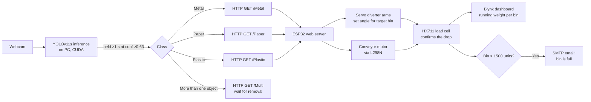
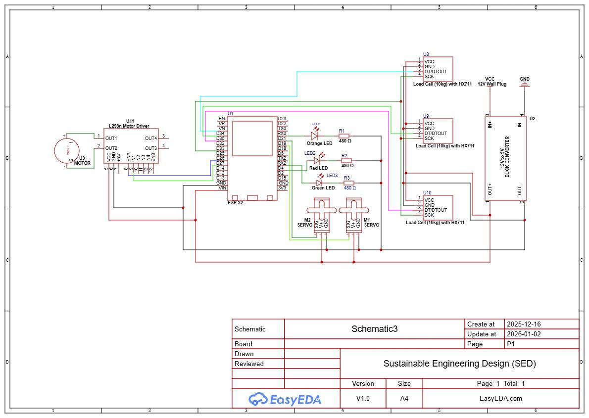
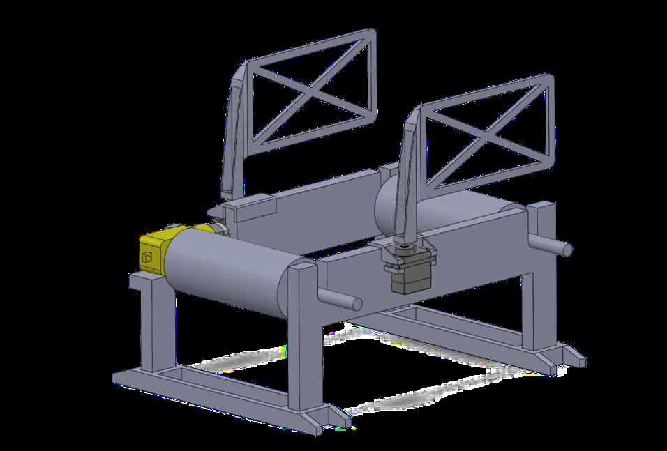
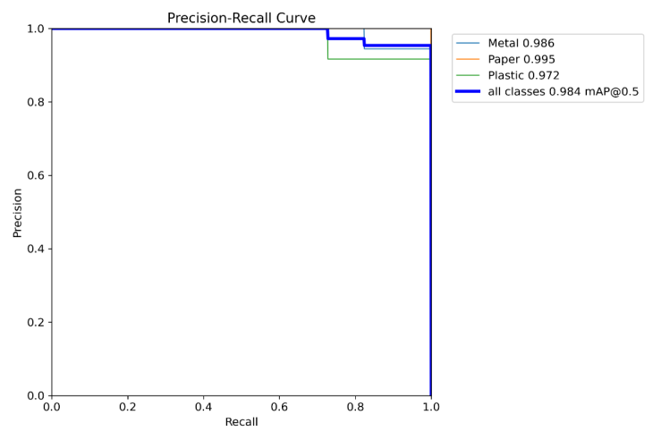
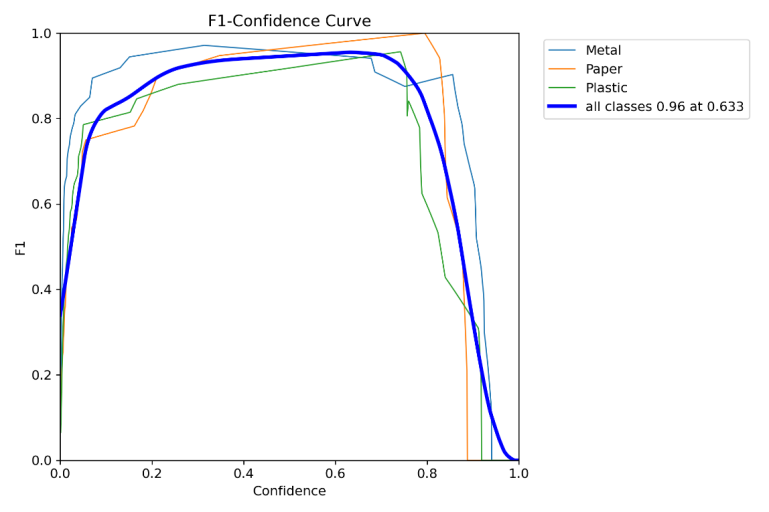
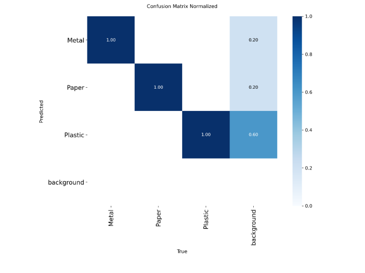
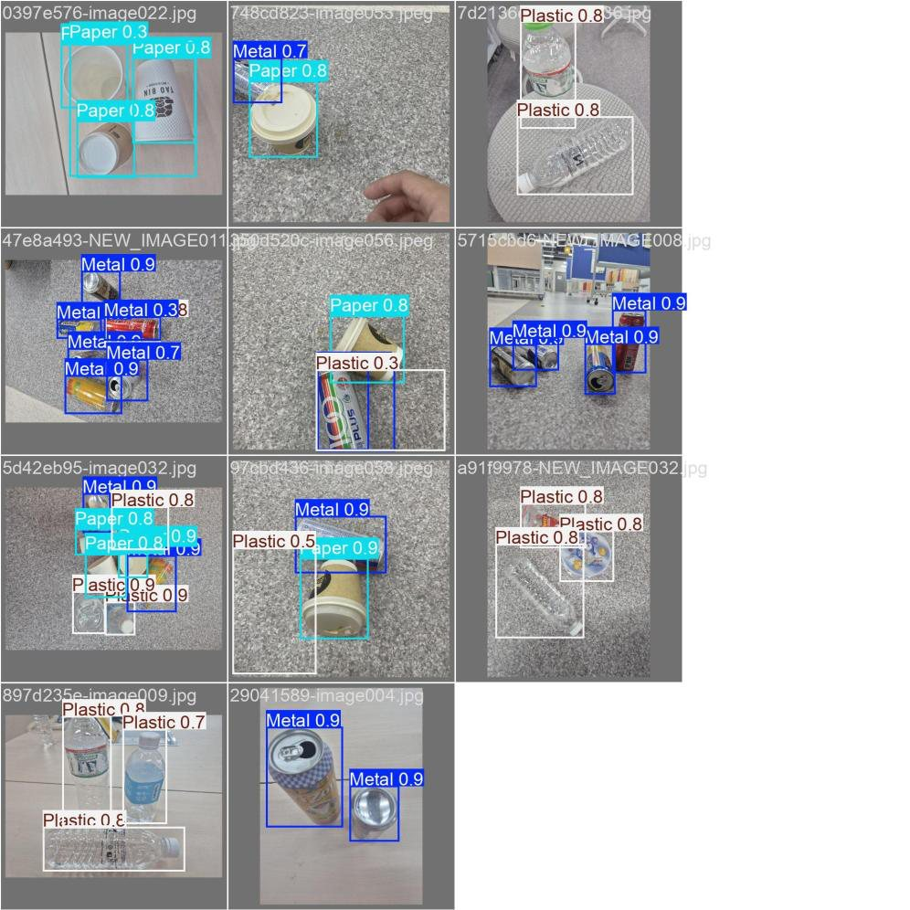
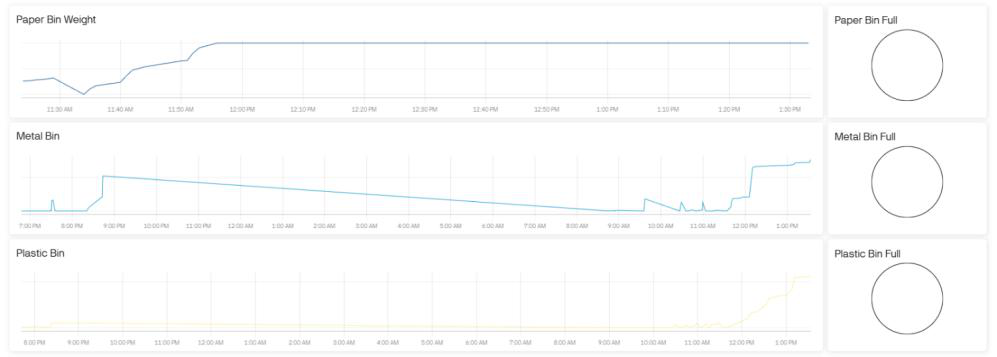
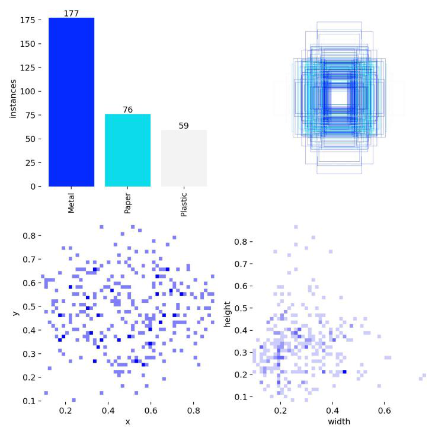

# Computer Vision Smart Waste Segregation System

A conveyor-based sorting rig that watches waste through a webcam, classifies it as
**metal, paper or plastic** with a custom-trained YOLO model, and drives a pair of
servo diverter arms to drop each item into its own load-cell-weighed bin — logging
running totals to an IoT dashboard and emailing a caretaker when a bin fills up.

<ul class="jo-tags">
<li>YOLOv11s</li><li>Ultralytics</li><li>Python</li><li>OpenCV</li><li>CUDA</li>
<li>ESP32</li><li>C++ / Arduino IDE</li><li>HX711 load cells</li><li>Servos</li>
<li>L298N motor driver</li><li>Blynk IoT</li><li>SMTP</li><li>SOLIDWORKS</li><li>EasyEDA</li>
</ul>

<div class="jo-spec" markdown="1">
<dl>
  <dt>Context</dt><dd>Sustainable Engineering Design, Sunway University — Group 2</dd>
  <dt>Timeline</dt><dd>April 2025 semester, report submitted 12 July 2025</dd>
  <dt>My role</dt><dd>Team member, one of six. See the note on attribution below.</dd>
  <dt>Status</dt><dd>Physical prototype built, trained and demonstrated end to end</dd>
  <dt>Framework</dt><dd>CDIO — Conceive, Design, Implement, Operate</dd>
</dl>
</div>

!!! note "A note on attribution"

    This was a six-person group project and the report credits Group 2 collectively
    rather than splitting work by person. I have not claimed individual ownership of
    any subsystem here. Ask me in an interview and I will tell you exactly which
    parts I wrote.

---

## Problem

Sunway City concentrates universities, malls and housing into a small footprint, and
generates a large volume of solid waste every day. The problem is not volume alone —
it is that waste arrives **mixed**. Mixed waste reduces recycling efficacy, pushes
more material into landfill, and loads the downstream disposal system.

Manual sorting is the usual answer, and it is slow, expensive and puts people in
direct contact with contaminated material. The project set out to automate the
separation step at the point of disposal.

## Approach

Rather than jumping to a solution, every significant decision was scored with a
weighted decision matrix against nine criteria grouped under the three pillars of
sustainability — environmental, social and economic.

| Decision | Options considered | Selected | Score |
| --- | --- | --- | --- |
| Solution type | Automated sorter · awareness campaign · manual facility · passive mechanical sorter | **Automated sorter (IoT + ML + actuators)** | 3.99 / 5 |
| Sorting mechanism | Servo hatch · conveyor belt · rotating sweeper | **Conveyor belt system** | 3.95 / 5 |
| Chassis material | PLA · PETG HF · ABS | **PLA** | 4.80 / 5 |
| Microcontroller | Arduino Nano · ESP32 · Raspberry Pi | **ESP32** | 4.20 / 5 |
| IoT platform | Blynk · ThingSpeak · custom | **Blynk** | 4.80 / 5 |
| Recognition method | Capacitive/inductive sensors · image recognition (ML) · hybrid | **Image recognition (ML)** | 4.45 / 5 |
| Object detection model | YOLO · SSD · Faster R-CNN | **YOLO** | 4.85 / 5 |

The ESP32 won on integrated Wi-Fi and Bluetooth for the IoT side; YOLO won on
real-time inference speed and how easily its dataset could be retrained.

### System architecture

Detection and actuation are split across two machines. A PC runs the inference
engine and acts as the *brain*; the ESP32 is the *body* and owns everything
physical. They talk over plain HTTP on the local network.



The detail I like most in this design is the **weight-confirmation loop**. The ESP32
does not assume the item landed. It records a baseline reading, opens the diverter,
runs the conveyor, and polls the load cell until the delta crosses a per-material
threshold — 10 units for metal, 15 for paper, 8 for plastic — only then logging the
weight and returning the servos to neutral. The sort is confirmed by physics, not by
a timer.

<figure markdown="span">
  
  <figcaption>Circuit schematic — ESP32 driving two servos and the conveyor motor via an L298N, with three independent HX711 load-cell amplifiers and a 12 V-to-5 V buck converter. Built on a donut perf board rather than a breadboard, because the rig vibrates.</figcaption>
</figure>

### Mechanical build

The conveyor was modelled in SOLIDWORKS and printed on a Bambu Lab X1 Carbon in
PLA at 10% rectilinear infill.

<figure markdown="span">
  
  <figcaption>The mechanical system: conveyor drums, beams, feet supports, motor brackets and the two servo diverter arms. Assembled it measures roughly 23 × 18 × 18.7 cm and uses 242.2 g of PLA.</figcaption>
</figure>

| Component | PLA including support (g) |
| --- | --- |
| Conveyor drums | 73.46 |
| Conveyor beams | 89.36 |
| Conveyor supports | 31.82 |
| Motor brackets | 6.65 |
| Servo diverter arm | 40.91 |
| **Total** | **242.20** |

## Key features

- **Real-time three-class detection** — metal, paper and plastic, from a live webcam feed.
- **Debounced triggering** — a class must be held continuously for one second above a
  0.63 confidence threshold before the ESP32 is called, which stops a single frame of
  noise from firing the diverters.
- **Multi-object guard** — if more than one bounding box appears, the system refuses to
  sort and waits for the extra item to be removed rather than guessing.
- **Per-bin weight tracking** — three independent HX711 load cells accumulate a running
  daily total per material.
- **Fill alerts** — crossing the full threshold pushes a flag to Blynk *and* sends an
  SMTP email naming the bin and its location, with hysteresis so a full bin does not
  re-alert until it has actually been emptied.
- **Non-blocking main loop** — the web server is serviced every iteration while load
  cells are polled on a 2-second timer, so a sort request is never missed.

## Results

The model was trained on a 110-image dataset of metal cans, paper cups and plastic
bottles at varied shapes, orientations and backgrounds, split 9:1 train/validation
over 50 epochs.

<figure markdown="span">
  
  <figcaption>Precision–recall curve. mAP@0.5 of <strong>0.984</strong> across all classes — paper 0.995, metal 0.986, plastic 0.972.</figcaption>
</figure>

<figure markdown="span">
  
  <figcaption>F1–confidence curve. Peak F1 of <strong>0.96 at 0.633 confidence</strong> — which is exactly why the inference script uses a 0.63 threshold in production.</figcaption>
</figure>

<figure markdown="span">
  
  <figcaption>Normalised confusion matrix. All three classes sit at 1.00 on the diagonal — no material was ever confused for another material. The remaining error is background being picked up as an object, most often as "Plastic" (0.60).</figcaption>
</figure>

<figure markdown="span">
  
  <figcaption>Validation predictions on held-out images, including cluttered multi-object scenes on carpet, tile and terrazzo.</figcaption>
</figure>

<figure markdown="span">
  
  <figcaption>The Blynk dashboard during an overnight run — accumulated weight per bin plus a full/not-full indicator for each.</figcaption>
</figure>

### What the numbers do and don't say

The headline figures are strong, but they come from a 110-image dataset with class
imbalance — **177 metal instances against 76 paper and 59 plastic**. That imbalance
is the most likely explanation for background being misread as plastic, the weakest
class. The honest read is that the model performs excellently *on data resembling its
training set*, and the fix is more paper and plastic instances rather than more epochs.

<figure markdown="span">
  
  <figcaption>Dataset composition. The class imbalance is visible top-left; the diffuse bounding-box overlay and scattered position/size plots show good variation in object scale and placement.</figcaption>
</figure>

## Challenges and solutions

<div class="annotate" markdown>

**Single frames triggering false sorts.** Momentary misdetections would fire the
diverter arms. Solved with a continuous-detection timer — a class has to persist for
a full second above threshold before a trigger is sent, and triggers latch until the
frame clears so one object cannot fire twice.

**Blocking HTTP calls stalling the video loop.** Calling the ESP32 synchronously
froze the capture loop. Requests were moved onto daemon threads with a 0.5 s timeout,
so an unreachable ESP32 prints a warning instead of hanging detection.

**Vibration loosening connections.** A solderless breadboard scored equal to a donut
perf board on the decision matrix, but the rig is shaken by a DC motor and two
servos. The perf board was chosen for connection stability; a custom PCB was ruled
out because overseas shipping would not fit the project window.

**Not knowing whether the item actually landed.** Rather than a fixed delay, each
handler polls its load cell against a material-specific threshold and only proceeds
once the weight delta confirms the drop.

**Background misclassified as plastic.** Identified from the confusion matrix and
attributed to dataset imbalance. Documented with a concrete remedy — equalise class
instances — rather than papered over.

</div>

## Video

<div class="jo-video-slot" markdown="1">
<strong>Demo video slot</strong>
No video file was found in this repository, so nothing is embedded yet.<br>
See the instructions below to add one.
</div>

!!! warning "For Joshua — how to add the demo video"

    Two options, depending on file size:

    **If the file is under ~25 MB** — drop it at
    `docs/assets/video/smart-bin-demo.mp4`, then replace the `jo-video-slot` block
    above with:

    ```html
    <video controls preload="metadata"
           poster="../assets/img/smart-waste-segregation/yolo-validation-predictions.jpg">
      <source src="../assets/video/smart-bin-demo.mp4" type="video/mp4">
      Your browser does not support embedded video.
    </video>
    ```

    **If it is larger than that** — don't commit it; it will bloat the repo
    permanently. Upload it as an unlisted YouTube video and replace the block with
    the standard YouTube `<iframe>` embed, or attach it to a GitHub Release and link
    to it. I have not uploaded anything anywhere on your behalf.

## Sustainability and stakeholders

The project was evaluated against all three sustainability pillars and validated
with external stakeholders:

- **Environmental** — cleaner separation raises recycling yield and reduces landfill
  dependency and the emissions from re-sorting and re-transporting mixed waste.
- **Economic** — reduces the labour cost of manual sorting while raising the value of
  recyclate through cleaner streams.
- **Social & safety** — removes direct human contact with waste, lowering hygiene,
  injury and contamination risk, and acts as a visible prompt for better disposal habits.

Stakeholder feedback shaped the priorities directly. **Mohammad Ali** (CEO, PET Bottle
Recycling, Savar International Trading) framed accurate differentiation as the
commercial requirement. **Dr Ker Pin Jern** (Professor, FET, Sunway University) pushed
for higher detection accuracy as a way to teach correct sorting behaviour.
**Assoc. Prof. Dr Chia Wai Chong** (Programme Leader, BEEE) stressed the need for
well-defined validation processes — which is why the results section above leads with
curves and a confusion matrix rather than a claim.

The system aligns with **UN SDGs 9, 11, 12 and 13**.
