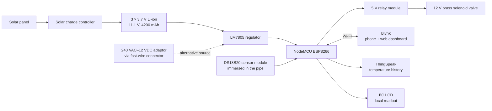
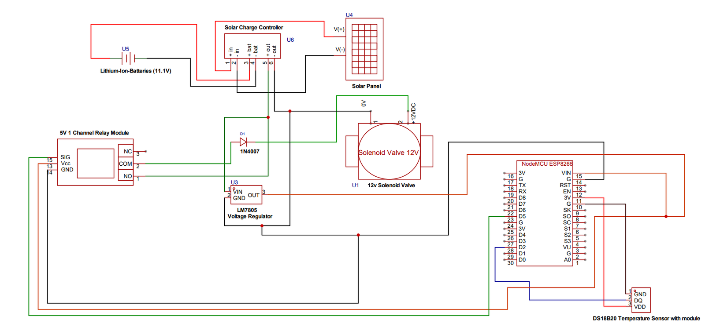
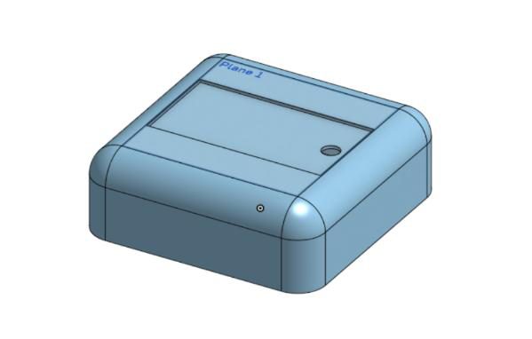
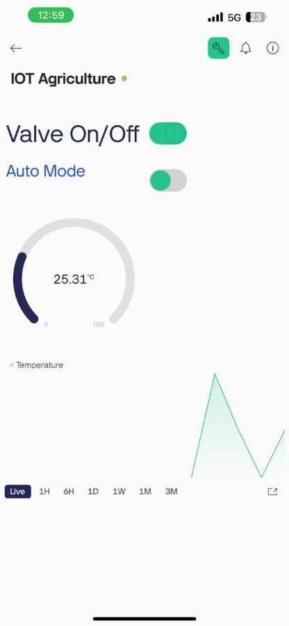
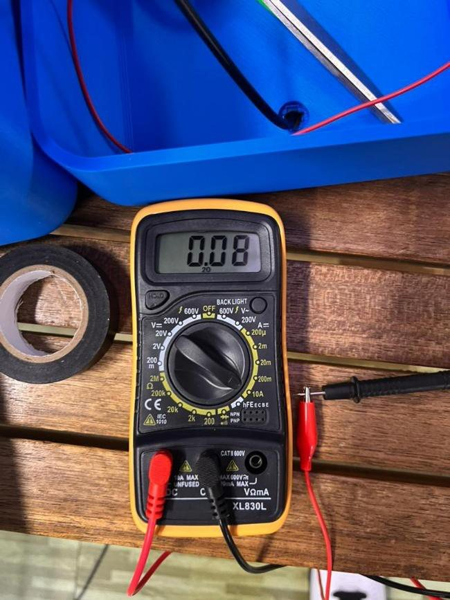

# Irrigation Water Temperature Monitoring with Automated Hot Water Release Control

Water sitting in exposed irrigation pipes under the Malaysian sun regularly exceeds
**50 °C**. Released onto crops it causes thermal shock and root burn — a real problem
in the fertigation systems used for vegetables. This controller measures pipeline
water temperature continuously, holds a solenoid valve shut until it is safe, flushes
the hot water instead of delivering it, and reports to a phone dashboard — running
off a solar-charged battery in the field.

<ul class="jo-tags">
<li>ESP8266 NodeMCU</li><li>C++ / Arduino IDE</li><li>DS18B20</li><li>Solenoid valve</li>
<li>Relay control</li><li>Blynk IoT</li><li>ThingSpeak</li><li>Solar charging</li>
<li>Li-ion</li><li>3D printing (ABS)</li><li>CAD</li>
</ul>

<dl>
  <dt>Context</dt><dd>EPM2003 Project Management &amp; Engineering Design, Sunway University — supervised by Ker Pin Jern</dd>
  <dt>Timeline</dt><dd>12 weeks from 8 May 2025; costs tracked to 14 August 2025; signed off 17 August 2025</dd>
  <dt>My role</dt><dd><strong>Project Manager and Software Engineer</strong> — owned project execution, coordinated five team members, and wrote the firmware</dd>
  <dt>Status</dt><dd>Built, assembled and bench-tested</dd>
  <dt>Cost</dt><dd>RM 135.91 in development, against a RM 150 budget</dd>
</dl>

---

## Problem

Malaysian agriculture runs hot and wet year-round. Fertigation — dissolving fertiliser
into irrigation water so plants absorb nutrients directly — is common, and it depends
on long runs of exposed pipe. Those pipes act as solar collectors. The water inside
can pass 50 °C, and when it is released it shocks roots and damages plant health,
cutting yield.

Farmers do not have the equipment or the time to check water temperature manually
before every irrigation cycle, and smallholders generally still use manual valve
control, which is inconsistent and labour-intensive. The need was for something
cheap and automatic that detects harmful temperature, stops hot water reaching the
plants, runs on clean energy, and can be checked remotely.

## My role

I was **project manager and software engineer** on a team of five — responsible for
the execution of the project, coordinating tasks between the product designers and
hardware technicians, and writing the code. The team ran on formal project management:
a work breakdown structure, a Gantt chart, and **critical path analysis putting the
project duration at 13 weeks** against a 12-week ideal.

| Role | Members |
| --- | --- |
| Project manager & software engineer | Oh Yu Qiao |
| Product designers (3D modelling) | Tay Li Yuen, Nicholas Lee Yong Wei |
| Hardware technicians (simulation, circuitry, soldering) | Alif Meherin, Bibi Irrma Fatimah Takun |

## Approach

The control logic is simple by design: read the water temperature, and if it is above
the safe band (35–40 °C), keep the valve shut or flush the hot water out before it
reaches the plants. The system supports both an **automatic mode** driven by the
threshold and a **manual mode** where the farmer toggles the valve from their phone.

<figure markdown="span">
  
  <figcaption>System schematic. Note the 1N4007 in the relay path — it is there for a reason, covered under challenges below.</figcaption>
</figure>

<figure markdown="span">
  
  <figcaption>The weatherproof enclosure, printed in ABS at 5 mm wall thickness for sunlight and water resistance, with a removable cover for maintenance access.</figcaption>
</figure>

## Key features

- **Continuous water temperature sensing** with a waterproof DS18B20 mounted through a
  drilled PVC connector cap so the probe sits in the water itself.
- **Automatic hot-water cutoff** at a configurable threshold — tested at 30 °C during
  validation.
- **Manual override** from the phone dashboard, with an auto/manual toggle.
- **Dual power paths** — solar-charged Li-ion, or a 240 VAC–12 VDC adaptor through a
  fast-wire connector, so the farmer can choose.
- **Open charging input** — the charge controller accepts an external solar supply, so
  a farmer with their own array does not have to use the built-in panel.
- **Remote monitoring** on both the Blynk phone app and web dashboard, with temperature
  history pushed to ThingSpeak.
- **Weatherproof, serviceable enclosure** with a mechanically locking lid — no adhesive.

<figure markdown="span">
  
  <figcaption>The Blynk mobile dashboard — valve control, auto/manual mode, live temperature gauge and history.</figcaption>
</figure>

## Results

**Built for RM 135.91**, inside the RM 150 budget.

### Power and runtime

Measured with an ammeter on the assembled system:

| Condition | Wall plug (12.0 V) | Li-ion (11.1 V) |
| --- | --- | --- |
| Valve closed (idle) | 0.08 A → 0.96 W | 0.08 A → 0.888 W |
| Valve open | 1.29 A → 15.48 W | 1.15 A → 12.765 W |

From the 4200 mAh pack that gives **52.5 hours idle** or **3.65 hours** with the valve
held continuously open. On a realistic duty cycle — valve open at most 30 minutes a
day — the system runs about **1 day 17 hours between charges**.

<figure markdown="span">
  
  <figcaption>Idle current measurement: 0.08 A with the valve closed.</figcaption>
</figure>

### Valve and leak testing

Flow was tested two ways — a blow test for airflow, then actual water. The valve
opened and closed reliably and held pressure with the pipe filled, **with no leakage
observed**. Leak testing was done by drying the assembly, wrapping tissue paper around
suspect joints and checking it after running water.

<figure markdown="span">
  
  <figcaption>Flow-rate testing the assembled system.</figcaption>
</figure>

### Cloud and control

Temperature values reached the cloud **every 5 to 8 seconds**. Valve on/off, and the
auto/manual switch, worked as intended from both the web and mobile clients — the
valve opened on schedule when the auto threshold was set to 30 °C.

### The solar finding

This is the most useful result in the project, and it is a negative one. The original
plan was to run the system primarily from solar. Measured under direct 5 PM sun with
an LED load, the panel produced:

- **5.85 V at 0.8 mA — 4.68 mW**

Against a 12.765 W requirement to open the valve, that is a shortfall of a factor of
**2,728**; even the 0.888 W idle draw is **190×** what the panel supplies. The panel
could not power the system, and the honest conclusion was to redefine its role: the
solar panel became a **trickle charger for the battery pack**, with a solar charge
controller added to make charging safer and more efficient. The system is
solar-*sustained*, not solar-*powered*, and the report says so.

## Challenges and solutions

**A 2.5 mm hole for a 2.8 mm pipe.** The enclosure was designed around the pipe's
inner dimension without accounting for the 1.5 mm wall thickness. The team sanded the
hole out by hand, which cost some structural integrity — fine hairline cracks are
visible around it under magnification. Documented rather than hidden; the lesson was
to dimension from the outer diameter.

**No locking mechanism on the lid.** The first design had no way to secure the cover.
Rather than glue it shut and lose serviceability, the team consulted experienced 3D
printing staff and redesigned the cover and body to lock together mechanically.

**Persistent −127 °C sensor readings.** The DallasTemperature library's code for a
communication failure with the DS18B20. Suspected cause was intermittent connection
through jumper wires, which loosen over time and can be faulty out of the packet. It
sometimes cleared on its own, which made it worse to diagnose. Resolved by buying a
dedicated DS18B20 breakout module — a deliberate trade of a few ringgit against
schedule slack on an unreliable fault.

**A destroyed buck converter and USB port.** Re-uploading firmware without
disconnecting the 5 V Vin supply caused a voltage conflict that smoked the step-down
converter and left the NodeMCU's micro-USB port unable to accept new code. Two power
modules of the same type were lost, likely from voltage spikes beyond their 7–12 V
input rating. The team fell back to an LM7805 — with the honest caveat recorded in
the report that it is inefficient, draws significant power and runs hot over long
periods, and a better converter should be specified for a production version.

**Relay chattering from back-EMF.** Switching the solenoid off induced a back-EMF
spike that rapidly re-triggered the relay. Fixed with a 1N4007 diode to block the
current backflow.

**Pipe leakage at the sensor entry.** Drilling the PVC connector cap for the DS18B20
probe left a large gap. Sealed with layered hot glue, PVC glue and white tack, plus
plumbing thread seal tape on the joints. Verified dry.

**Wi-Fi dropping when the lid went on.** The enclosure attenuated the ESP8266's
onboard antenna badly enough to cause disconnect/reconnect cycles, lag spikes and
delayed valve commands. Not solved within the project — the recommended fix is an
ESP-07 or ESP-12F with a u.FL connector and the antenna mounted outside the box.

## What I would do differently

The report closes with a prioritised improvement list, and these are the ones that
matter most:

- **Swap the solenoid for a motorised ball valve.** The solenoid must be held
  energised to stay open, which is where nearly all the power goes. A motorised ball
  valve draws power only while moving.
- **Larger panel, or a different harvest.** The current panel is far too small for
  anything beyond trickle charging.
- **External antenna** to fix the enclosure's Wi-Fi attenuation.
- **Pump or gravity-fed redesign.** The pipeline was built horizontally, so at low
  water levels there is not enough pressure to push water out when the valve opens and
  some remains in the pipe. Either add a small pump or route the pipeline high-to-low
  and let gravity do it.
- **Hybrid cloud strategy.** Blynk's free tier limits upload latency and storage.
  Using Blynk for valve control and ThingSpeak for temperature history gets both
  without the subscription.
- **On-device smart scheduling.** A decision tree or tiny neural network could
  minimise valve hold time while still meeting irrigation needs, skip unnecessary
  uploads to save both quota and power, and schedule high-draw events into sunny
  periods when the panel is actually contributing.
